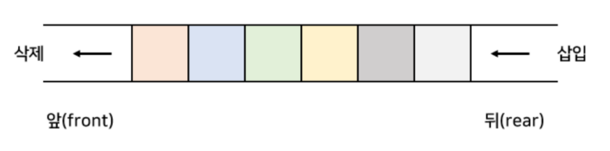
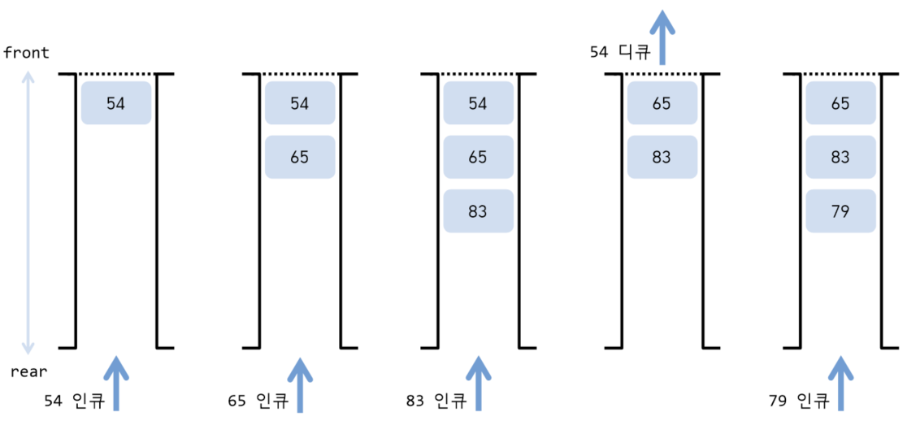
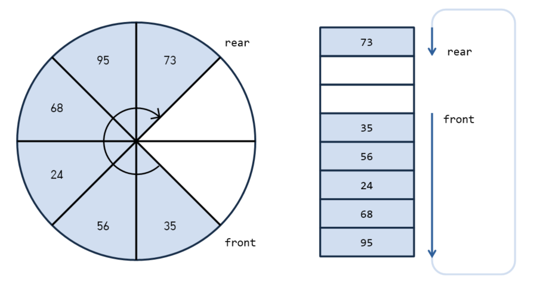

# 4. 큐란?

## (1) 큐 알아보기
- 가장 먼저 넣은 데이터를 가장 먼저 꺼내는 선입선출(FIFO)구조
- 데이터를 추가하는 작업을 인큐(enqueue), 꺼내는 작업을 디큐(dequeue)
- 꺼내는 쪽을 프론트(front), 넣는쪽을 리어(rear)
<center>
      
</center>

## (2) 배열로 큐 구현하기
<center>
      
</center>

- 인큐
  - 데이터를 인큐하면 맨 끝 데이터가 저장되어 있는 곳의 다음 원소에 저장
  - 처리복잡도는 O(1), 비교적 적은 비용으로 구현
- 디큐
  -  데이터를 디큐하면 맨 처음 데이터가 꺼내지고 그 이후 모든 원소를 앞쪽을 옮김
  - 처리복잡도는 O(n)

> 우선순위 큐  
> : 인큐할 때는 데이터에 우선순위를 부여하여 추가하고, 디큐할 때 우선순위가 가장 높은 데이터를 꺼내는 방식  
> heapq 모듈에서 제공

## (3) 링 버퍼로 큐 구현
- 링 버퍼 : ring buffer, 디큐할 때 배열 안의 원소를 옭기지 않는 큐
  
    <center>
    
    </center>

    - 처리복잡도 O(1)
    ```
    # 고정길이 큐 클래스 FixedQueue 구현하기
    from typing import any

    class FixedQueue:
        class Empty(Exception):
        # 비어있는 Fi
    ```