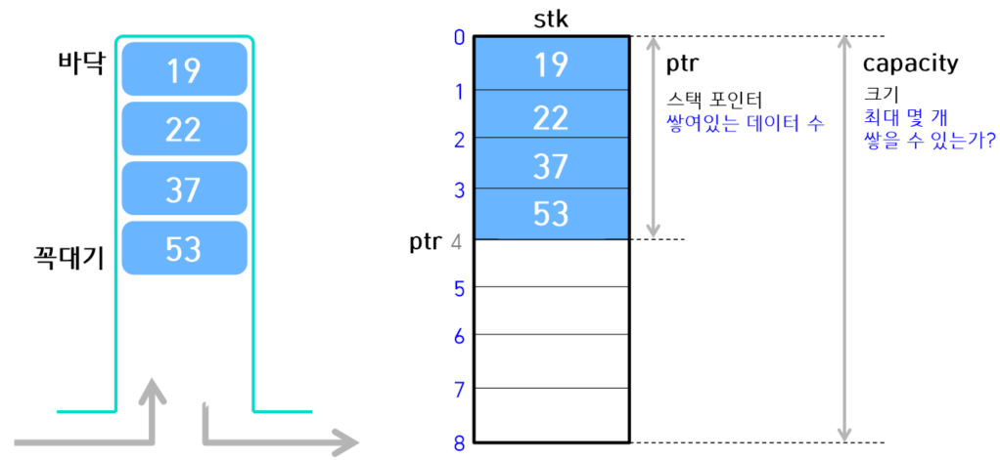

# 4. 스택이란?

## (1) 스택 알아보기
- 데이터를 임시 저장할 때 사용하는 자료구조
- 데이터의 입력과 출력 순서는 후입선출(LIFO)방식  
   
<center>
    
</center> 


## (2) 스택 구현하기
- 스택 배열 : stk  
  push한 데이터를 저장하는 스택 본체인 list형 배열  
  index가 0인 원소의 스택이 바닥  
  ```stk[0]``` : 가장 먼저 push하여 데이터를 저장하는 곳
- 스택 크기 : capacity  
  스택 최대 크기를 나타내는 int형 정수  
  ```len(stk)```와 일치
- 스택 포인터 : ptr  
  스택에 쌓여있는 데이터의 개수를 나타내는 정수값  
  빈 스택 : ptr의 값 = capacity의 값 = 0  
  - 가장 먼저 push한 데이터 : ```stk[0]``` = 19
  - 가장 마지막에 push한 데이터 : ```stk[ptr-1]``` = 53
  
<center>
    
</center>

- 스택에서 사용하는 예외 클래스와 사용하는 함수  
  - **Empty** 예외 처리 클래스 
  - **Full** 예외 처리 클래스 
  - **```__init__()```** 초기화 하는 함수 
  - **```__len()__```** 쌓여있는 데이터 개수를 알아내는 함수
    > ```__``` : dunder (double underscore )  
    >> 클래스에 ```__len()__``` 함수를 정의하면 츨래서형의 인스턴스를 ```len()```함수에 전달할 수 있음  
    ex) 클래스형의 인스턴스 ```obj```에 대한 ```__len__()```함수를 호출하는 ```obj.__len__()```를 ```len(obj)```로 작성 가능
  - **```is_empty()```** 스택이 비어 있는지를 판단하는 함수
  - **```is_full()```** 스택이 가득 차 있는지를 판단하는 함수  
    ```
    # 고정 길이 스택 클래스 FixedStack 구현하기
    from typing import Any

    class FixedStack:
        # 고정 길이 스택 클래스

        class Empty(Exception):
            # 비어 있는 FixedStack에 pop 또는 peak할 때 내보내는 예외 처리
            pass
        
        class Full(Exception):
            # 가득 찬 FixedStack에 push할 때 내보내는 예외 처리
            pass
        
        def __init__(self, capacity: int=256):
            # 스택 초기화 : None
            self.stk = [None] * capacity  # 스택 본체
            self.capacity = capacity      # 스택 크기
            self.ptr = 0                  # 스택 포인터

        def __len__(self):
            # 스택에 쌓여있는 개수를 반환 : int
            return self.ptr
        
        def is_empty(self):
            # 스택이 비어있는지 판단 : bool
            return self.ptr <= 0
        
        def is_full(self):
            # 스택이 가득 차 있는지 판단 : bool
            return self.ptr >= self.capacity
    ```
    > **예외 처리의 기본 구조**  
    오류를 복구해 프로그램이 실행되다가 중단되는 것을 피할 수 있음  
    원래 처리하는 코드와 오류가 발생할 때 대처하는 코드를 분리할 수 있음  
    ```
    # try statement
    try: 
        # 원래 처리
        suite(header와 한 세트로 따라다니는 실행문)
    except:                   # 1개 이상
        # 예외 포착과 처리
        suite 작성
    else:                     # 생략 가능
        # 예외가 포착되지 않음
        suite
    finally:                  # 생략 가능
        # 마무리
        suite
 

    # try-finally statement
    try: suite
    finally: suite
    ```

  - **```push()```** 데이터를 푸쉬하는 함수
  - **```pop()```** 데이터를 팝하는 함수
  - **```peek()```** 데이터를 들여다보는 함수
  - **```clear()```** 스택의 모든 데이터를 삭제하는 함수
    ```
    def push(self, value):
        # 스택에 value(Any)를 넣음 : None
        if self.is_full():
            # 스택이 가득 차 있는 경우 예외 처리 발생
            raise FixedStack.Full
        self.stk[self.ptr] = value
        self.ptr += 1
    
    def pop(self):
        # 스택 꼭대기 데이터를 팝 : Any
        if self.is_empty():
            # 스택이 비어 있는 경우 예외 처리 발생
            raise FixedStack.Empty
        self.ptr -= 1
        return self.stk[self.ptr]
    
    def peek(self):
        # 스택에서 꼭대기 데이터를 들여다봄 : Any
        if self.is_empty():
            # 스택이 비어 있는 경우 예외 처리 발생
            raise FixedStack.Empty
        return self.stk[self.ptr - 1]
    
    def clear(self):
        # 스택을 비움 : None
        self.ptr = 0

    ```
    > **raise 문을 통한 예외 처리**  
    표준 내장 예외 처리 : python이 제공, BaseException 클래스와 직간접적으로 파생한 클래스로 제공  
    사용자 정의 예외처리 : Exception 클래스(또는 그 파생 클래스)에서 파생하는 것이 원칙. BaseExcetion 클래스는 사용자 정의 클래스가 파생하는 것을 전제로 하기 때문.
  - **```find()```** 데이터를 검색하는 함수
  - **```count()```** 데이터 개수를 세는 함수 
  - **```__contains__()```** 데이터가 포함되어 있는지 판단하는 함수 (컨테이너 객체 = 메서드가 구현되어 있음)  
    > ```__``` : dunder  
    >> 클래스에 ```__contains__()``` 함수를 정의하면 클래스형의 인스턴스에 멤버십 판단 연산자인 ```in```을 적용 할 수 있음.   
    ex) 클래스형의 인스턴스 ```obj```에 대한 ```__contains__()```함수를 호출하는 ```obj.__contains__(x)```를 ```x in obj```로 작성 가능
    ```
    def find(self, value):
        # 스택에서 value(Any)를 찾아 index를 반환 : Any
        for i in range(self.ptr -1, -1, -1): # 꼭대기부터 선형검색
            if self.stk[i] == value:
                return i                     # 검색 성공
        return -1                            # 검색 실패

    def count(self, value):
        # 스택에 포함되어있는 value의 개수를 반환 : bool
        count = 0
        for i in range(self.ptr):            # 바닥 쪽부터 선형 검색
            if self.stk[i] == value:
                count += 1                   # 들어 있음
        return count

    def __contains__(self, value):
        # 스택에 value(Any)가 있는가? : bool
        return self.count(value) > 0

    def dump(self):
        # 스택 안의 모든 데이터를 바닥부터 꼭대기 순으로 출력 : None
        if self.is_empty():                  # 스택이 비어 있음
            print('스택이 비어 있습니다.')
        else:
            print(self.stk[:self.ptr])
 
    ```

## (3) 스택 프로그램 만들기
```
from enum import Enum
from fixed_stack import FixedStack

Menu = Enum('Menu', ['푸시', '팝', '피크', '검색', '덤프', '종료'])

def select_menu():
    # 메뉴 선택
    s = [f'({m.value}){m.name}' for m in Menu]
    while True:
        print(*s, sep = '   ', end='')
        n = int(input(': '))
        if 1 <= n <= len(Menu):
            return Menu(n)

s = FixedStack(64)  # 최대 64개를 푸시할 수 있는 스택

while True:
    print(f'현재 데이터 개수: {len(s)} / {s.capacity}')
    menu = select_menu()  # 메뉴 선택
    
    if menu == Menu.푸시:  # 푸시
        x = int(input('데이터를 입력하세요.: '))
        try:
            s.push(x)
        except FixedStack.Full:
            print('스택이 가득 차 있습니다.')

    elif menu == Menu.팝:  # 팝
        try:
            x = s.pop()
            print(f'팝한 데이터는 {x}입니다.')
        except FixedStack.Empty:
            print('스택이 비어 있습니다.')

    elif menu == Menu.피크:  # 피크
        try:
            x = s.peek()
            print(f'피크한 데이터는 {x}입니다.')
        except FixedStack.Empty:
            print('스택이 비어 있습니다.')

    elif menu == Menu.검색:  # 검색
        x = int(input('검색할 값을 입력하세요.: '))
        if x in s:
            print(f'{s.count(x)}개 포함되고, 맨 앞의 위치는 {s.find(x)}입니다.')
        else:
            print('검색값을 찾을 수 없습니다.')

    elif menu == Menu.덤프:  # 덤프
        s.dump()

    else:
        break
```
> ```collections.deque```로 스택 구현하기
```
from typing import Any
from collections import deque

class Stack:
    # 고정 길이 스택 클래스(collections.deque를 사용)

    def __init__(self, maxlen: int = 256) -> None:
        """초기화 선언"""
        self.capacity = maxlen
        self.__stk = deque([], maxlen)

    def __len__(self) -> int:
        """스택에 쌓여있는 데이터 개수를 반환"""
        return len(self.__stk)

    def is_empty(self) -> bool:
        """스택이 비어 있는지 판단"""
        return not self.__stk

    def is_full(self) -> bool:
        """스택이 가득 찼는지 판단"""
        return len(self.__stk) == self.__stk.maxlen

    def push(self, value: Any) -> None:
        """스택에 value를 푸시"""
        self.__stk.append(value)

    def pop(self) -> Any:
        """스택에서 데이터를 팝"""
        return self.__stk.pop()

    def peek(self) -> Any:
        """스택에서 데이터를 피크"""
        return self.__stk[-1]

    def clear(self) -> None:
        """스택을 비웁니다"""
        self.__stk.clear()

    def find(self, value: Any) -> Any:
        """스택에서 value를 찾아 인덱스(없으면 -1)를 반환"""
        try:
            return self.__stk.index(value)
        except ValueError:
            return -1

    def count(self, value: Any) -> int:
        """스택에 포함된 value의 개수를 반환"""
        return self.__stk.count(value)

    def __contains__(self, value: Any) -> bool:
        """스택에 value가 포함되어 있는지 판단"""
        return self.count(value)

    def dump(self) -> int:
        """스택 안에 있는 모든 데이터를 나열"""
        print(list(self.__stk))
```